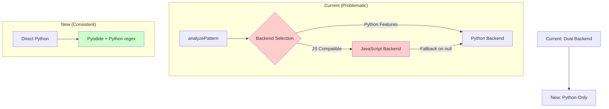

# JavaScript Regex Removal & Python-Only Migration Plan

## **CRITICAL ISSUE**

The project has a fundamental design flaw: JavaScript regex and Python regex produce inconsistent results for the same patterns. Even perfectly valid patterns return different objects (null vs empty matches), making the dual-backend approach unsustainable.

## **SOLUTION APPROACH**

Transition to a Python-only implementation using Pyodide. This will be slower but provide consistent, reliable results that match Python's regex behavior exactly.

## **ARCHITECTURE CHANGE**



## **IMPLEMENTATION PHASES**

### **PHASE 1: Core Removal (Single File Visits)**

#### 1.1 Delete [`src/backends/javascript.ts`](src/backends/javascript.ts)
- **Action**: Remove entire file (356 lines)
- **Impact**: Eliminates `JSMatch` and `JSPattern` classes
- **Reason**: JavaScript regex implementation is fundamentally incompatible

#### 1.2 Delete [`src/utils/pattern-analyzer.ts`](src/utils/pattern-analyzer.ts)
- **Action**: Remove entire file (160 lines)
- **Impact**: Eliminates `analyzePattern()`, `convertFlags()`, and feature detection
- **Reason**: No longer need backend routing logic

#### 1.3 Update [`src/index.ts`](src/index.ts) (Lines 1-246)
- **Remove imports**:
  ```typescript
  import { analyzePattern, convertFlags, escape } from './utils/pattern-analyzer.js';
  import { compile as jsCompile } from './backends/javascript.js';
  ```
- **Simplify `compile()` function** (Line 11):
  ```typescript
  // OLD: Complex routing logic
  const analysis = analyzePattern(pattern, flags);
  if (analysis.backend === 'python') {
    return await pyCompile(pattern, flags);
  } else {
    const jsFlags = convertFlags(flags);
    return jsCompile(pattern, jsFlags);
  }
  
  // NEW: Direct Python compilation
  return await pyCompile(pattern, flags);
  ```
- **Remove fallback logic** in:
  - `search()` (Lines 34-44)
  - `match()` (Lines 50-60) 
  - `fullmatch()` (Lines 66-76)
- **Remove functions**:
  - `requiresPython()` (Line 148)
  - `analyze()` (Line 156)
- **Move `escape()` inline** (since pattern-analyzer.ts is deleted)

### **PHASE 2: Type System Simplification**

#### 2.1 Update [`src/types/index.ts`](src/types/index.ts) (Lines 1-168)
- **Remove `RegexBackend` type** (Line 159)
- **Remove `backend` property** from `Pattern` interface (Line 89)
- **Merge with `AsyncPattern`**: Make all Pattern methods async
  ```typescript
  // OLD: Separate sync/async interfaces
  interface Pattern {
    search(string: string): Match | null;
  }
  
  // NEW: Unified async interface
  interface Pattern {
    search(string: string): Promise<Match | null>;
  }
  ```

#### 2.2 Delete [`src/types/async.ts`](src/types/async.ts)
- **Action**: Remove entire file (77 lines)
- **Reason**: No longer need separate async interface

#### 2.3 Update [`src/backends/python.ts`](src/backends/python.ts) (Lines 1-645)
- **Remove `backend` property** from `PythonPattern` (Line 416)
- **Update class** to implement unified `Pattern` interface
- **Simplify `compile()` function** (Line 640)

### **PHASE 3: Test Infrastructure Cleanup**

#### 3.1 Clean Test Files
- **Remove**: Tests that specifically validate JavaScript backend
- **Remove**: Backend selection and routing tests
- **Keep**: Python regex validation tests
- **Update**: Import statements to reflect new structure

#### 3.2 Update [`package.json`](package.json)
- **Remove dependency**: `"core-js": "^3.42.0"` (Line 56)
- **Reason**: No longer need JavaScript polyfills
- **Keep**: `"pyodide": "^0.27.7"` (Line 57)

### **PHASE 4: Documentation Updates**

#### 4.1 Update [`README.md`](README.md)
- **Line 13**: Remove "automatic backend selection"
- **Line 6**: Change to "Python regex implementation via Pyodide"
- **Line 15**: Remove JavaScript performance claims
- **Update**: All examples to show async-only usage

#### 4.2 Create Documentation Files
- **`TODO.md`**: Track refactoring progress
- **`ISSUE.md`**: Document the fundamental design flaw

## **IMPLEMENTATION SEQUENCE**

```mermaid
gantt
    title Refactoring Implementation Timeline
    dateFormat X
    axisFormat %s

    section Phase 1: Core Removal
    Delete javascript.ts           :done, 1, 1
    Delete pattern-analyzer.ts     :2, 2  
    Update index.ts               :3, 3
    
    section Phase 2: Types
    Update types/index.ts         :4, 4
    Delete types/async.ts         :5, 5
    Update backends/python.ts     :6, 6
    
    section Phase 3: Tests
    Clean test files              :7, 7
    Update package.json           :8, 8
    
    section Phase 4: Docs
    Update README.md              :9, 9
    Create documentation          :10, 10
```



## **FILES AFFECTED**

### **DELETE (3 files)**
- `src/backends/javascript.ts` (356 lines)
- `src/utils/pattern-analyzer.ts` (160 lines)
- `src/types/async.ts` (77 lines)

### **MODIFY (6 files)**
- `src/index.ts` - Remove routing, simplify to Python-only
- `src/types/index.ts` - Remove backend concepts, unify interfaces
- `src/backends/python.ts` - Become sole backend implementation
- `README.md` - Update to reflect Python-only approach
- `package.json` - Remove JavaScript dependencies
- Test files - Remove JavaScript backend tests

### **CREATE (3 files)**
- `TODO.md` - Progress tracking
- `ISSUE.md` - Design flaw documentation
- `PLAN.md` - This refactoring plan

## **RISK MITIGATION**

1. **Git Backup**: Commit current state before starting
2. **Incremental Testing**: Run tests after each phase
3. **Type Safety**: TypeScript will catch API mismatches
4. **Performance Documentation**: Note performance implications

## **EXPECTED OUTCOMES**

- **Consistency**: All regex operations will behave identically to Python
- **Simplicity**: Reduced codebase complexity (500+ lines removed)
- **Maintainability**: Single backend to maintain and debug
- **Performance**: Slower but predictable and reliable
- **API**: Clean, async-only interface without backend confusion

## **NEXT STEPS**

1. Switch to code mode for implementation
2. Execute phases sequentially 
3. Test after each major change
4. Update documentation continuously
5. Return control to orchestrator upon completion