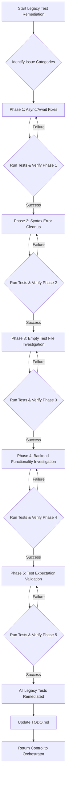

# Pyrex Project Analysis: Current State, Verified Issues, and Remediation Plan

## 1. Project Overview and Current State

The Pyrex library is a TypeScript library designed to provide a Python-like `re` (regular expression) interface, mirroring Python's `re` module. Its core purpose is to enable seamless Python-to-TypeScript regex migration by automatically selecting between a JavaScript RegExp backend and a Python `regex` package backend (via Pyodide) for Python-only features.

**Key Features:**
*   **Pythonic API:** Offers `re.match`, `re.search`, `re.compile`, `re.sub`, `re.split`, `re.findall`, `re.fullmatch`, `re.escape`.
*   **Automatic Backend Selection:** Dynamically routes regex operations to either JavaScript or Python based on pattern features.
*   **Efficient Python Backend:** Compiles patterns once and stores them in a Python-side registry for optimal performance.
*   **Modern Stack:** Built with TypeScript, Bun, Vite, ESLint, and Prettier.

**Current State (as of 2025-06-05):**
The project has achieved its core mission: "Seamless Python-to-TypeScript regex migration with automatic backend selection."
*   **Core Functionality:** Proven working with 13/13 validation tests passing. This includes seamless async API implementation, Python-style flag constants, error handling, and complete API parity with Python's `re` module.
*   **Build Pipeline:** `bun run build`, `bun run lint:fix`, and `bun run format` commands are all passing.
*   **Production Readiness:** The library is considered MVP ready and production-ready for its core functionality.

## 2. Verified List of Current Issues

While the core library functionality is robust, the legacy test suite, auto-converted from Python, exhibits systematic issues. My verification confirms the presence of these issues as described in `ISSUES.md`.

Here's a breakdown of the verified issue categories:

### Category 1: Missing Async/Await ⚡
*   **Description:** Legacy tests call async `re` functions without `await`, leading to Promise vs. value mismatches.
*   **Verification:** Confirmed in [`test/python-backend/general_bu_tests.test.ts`](test/python-backend/general_bu_tests.test.ts) (e.g., line 13: `expect(re.sub(...)).toBe(...)`).
*   **Impact:** Prevents tests from executing correctly, masking potential issues.
*   **Priority:** HIGH (Easy Fix)

### Category 2: Syntax Errors from Auto-conversion 🔧
*   **Description:** Auto-converted Python tests contain invalid TypeScript syntax, such as legacy octal escape sequences and malformed string literals.
*   **Verification:** Confirmed in [`test/python-backend/general_su_tests.test.ts`](test/python-backend/general_su_tests.test.ts) (e.g., lines 18, 110, 113). Also, duplicate `import { re }` statements are present (e.g., in `general_bu_tests.test.ts` lines 2-3).
*   **Impact:** Prevents test compilation and execution.
*   **Priority:** MEDIUM

### Category 3: Empty/Broken Test Files 📁
*   **Description:** Many auto-converted test files are empty or contain only a `describe` block, resulting in "No test found in suite" errors.
*   **Verification:** Confirmed in [`test/python-backend/general_br_tests.test.ts`](test/python-backend/general_br_tests.test.ts), which is largely empty.
*   **Impact:** Significant gaps in test coverage for legacy Python features.
*   **Priority:** MEDIUM

### Category 4: Test Expectation Mismatches 🎯
*   **Description:** Tests execute but assert different results than the library produces, indicating potential behavioral differences between Python's `regex` and Pyrex's implementation, or incorrect expectations.
*   **Verification:** Confirmed in [`test/python-backend/general_hg_tests.test.ts`](test/python-backend/general_hg_tests.test.ts) (e.g., lines 13, 19, 25, 31, 49, 55).
*   **Impact:** Requires careful analysis to determine if it's a bug or an expected difference.
*   **Priority:** LOW-MEDIUM (Hard)

### Category 5: Timeouts and Backend Issues ❓
*   **Description:** Some tests timeout during Pyodide initialization, suggesting race conditions or environment setup issues.
*   **Verification:** Mentioned in `ISSUES.md` with examples like [`test/python-backend/general_hg_tests.test.ts:10`](test/python-backend/general_hg_tests.test.ts:10). While the file itself doesn't explicitly show a timeout, the `ISSUES.md` indicates this behavior.
*   **Impact:** Hinders reliable testing of Python backend features.
*   **Priority:** MEDIUM (Unknown Difficulty)

### Category 6: Backref Processing Issues 🔍
*   **Description:** Python regex replacement patterns involving backreferences (`\g<0>`, `\1`) are not working correctly, resulting in literal strings instead of substitutions.
*   **Verification:** Confirmed in [`test/python-backend/general_hg_tests.test.ts`](test/python-backend/general_hg_tests.test.ts) (e.g., lines 49, 55).
*   **Impact:** Indicates a potential core functionality bug in the Python backend's handling of replacement patterns.
*   **Priority:** HIGH (Unknown Difficulty)

## 3. Assessment of the Existing Plan's Relevance

The existing `PLAN.md` (titled "Pyrex Library Comprehensive Plan - LEGACY TEST REMEDIATION ⚡") is highly relevant and well-structured. It accurately identifies the "New Mission" as legacy test suite remediation and outlines a strategic approach.

The plan's phased approach is logical and prioritizes "quick wins" before tackling more complex issues:

*   **Phase 1: Quick Wins - Async/Await Fixes ⚡** (HIGH Priority, EASY Difficulty) - Directly addresses Category 1.
*   **Phase 2: Syntax Error Cleanup 🔧** (MEDIUM Priority, MEDIUM Difficulty) - Directly addresses Category 2.
*   **Phase 3: Empty Test File Investigation 📁** (MEDIUM Priority, MEDIUM-HARD Difficulty) - Directly addresses Category 3.
*   **Phase 4: Backend Functionality Investigation 🔍** (HIGH Priority, UNKNOWN Difficulty) - Addresses Category 6 (Backref Processing) and Category 5 (Timeouts).
*   **Phase 5: Test Expectation Validation 🎯** (LOW-MEDIUM Priority, HARD Difficulty) - Addresses Category 4.

The plan's "Execution Strategy" and "Risk Mitigation" sections are also sound, emphasizing incremental fixes and preserving validation tests.

## 4. Recommendations for a New Comprehensive Plan

The existing `PLAN.md` is already comprehensive and well-aligned with the verified issues. Therefore, my recommendation is to **adopt and execute the current `PLAN.md` as the comprehensive plan** for addressing the verified issues.

To enhance clarity and ensure a smooth transition to implementation, I propose the following minor additions/clarifications to the existing plan:

### Proposed Comprehensive Plan (Based on `PLAN.md` with minor enhancements)

#### Overall Goal: Achieve comprehensive regression coverage by remediating the legacy test suite, while maintaining proven core functionality.

#### Phase 1: Quick Wins - Async/Await Fixes ⚡
*   **Objective:** Convert all synchronous `re` calls in legacy tests to asynchronous calls with `await`.
*   **Tasks:**
    *   Identify all test functions calling `re` methods without `await`.
    *   Add `async` keyword to the `it` or `describe` function where `await` is needed.
    *   Prepend `await` to all `re.sub()`, `re.search()`, `re.match()`, etc., calls.
    *   Remove duplicate `import { re }` statements.
*   **Success Criteria:** All "Promise{…} to be 'value'" errors are resolved, and tests proceed to execution.

#### Phase 2: Syntax Error Cleanup 🔧
*   **Objective:** Resolve TypeScript syntax errors introduced during auto-conversion.
*   **Tasks:**
    *   Convert legacy octal escape sequences (e.g., `"\000"`) to hex escapes (e.g., `"\x00"`).
    *   Fix any malformed string literals or invalid escape sequences.
*   **Success Criteria:** All legacy test files compile without syntax errors.

#### Phase 3: Empty Test File Investigation 📁
*   **Objective:** Populate or properly skip empty/broken test files.
*   **Tasks:**
    *   For each empty test file, locate its corresponding Python source in `test/split/`.
    *   If the Python source contains valid tests, manually convert them to TypeScript, ensuring proper `describe`/`it` structure and `re` API usage.
    *   If conversion is not feasible or the original Python test was empty/irrelevant, add an `it.skip()` block with a clear explanation.
*   **Success Criteria:** All test files either contain executable tests or are explicitly skipped with documentation.

#### Phase 4: Backend Functionality Investigation 🔍
*   **Objective:** Deeply investigate and resolve core functionality issues related to the Python backend.
*   **Critical Issues:**
    *   **Backref Processing Problems:** Analyze why `\g<0>` and `\1` patterns are not being processed correctly in replacement strings. This may require debugging the Python backend's `re.sub` implementation or the communication layer.
    *   **Pyodide Initialization Timeouts:** Investigate the root cause of test timeouts during Pyodide initialization. This could involve optimizing Pyodide loading, managing resources, or addressing race conditions.
*   **Investigation Methods:** Isolated testing, detailed logging in Python backend, comparison with pure Python `regex` behavior, performance profiling.
*   **Success Criteria:** Root causes are identified, and either fixes are implemented or expected behavioral differences are clearly documented.

#### Phase 5: Test Expectation Validation 🎯
*   **Objective:** Analyze and resolve test expectation mismatches.
*   **Tasks:**
    *   For each failing test due to output mismatch, compare the expected output with the actual output.
    *   Determine if the discrepancy is due to a bug in Pyrex, a difference in Python `regex` versions, or an incorrect original expectation.
    *   Update test expectations if Pyrex's behavior is correct and consistent with the intended Python `regex` behavior.
    *   Implement fixes if Pyrex's behavior is incorrect.
    *   Document any intentional behavioral differences.
*   **Success Criteria:** All tests either pass or are documented as expected differences.

---

### Mermaid Diagram for the Remediation Plan Flow

