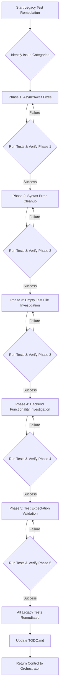

# Pyrex Project Comprehensive Remediation Plan

## Executive Summary

The Pyrex library has successfully achieved its core mission of providing a seamless Python-to-TypeScript regex migration experience with automatic backend selection. While the core functionality is robust and validated by passing tests, the legacy test suite, which was auto-converted from Python, exhibits systematic issues. This comprehensive plan outlines a phased strategy to remediate these legacy tests, ensuring full regression coverage, maintaining the proven core functionality, and enhancing the overall stability and reliability of the Pyrex library.

## Priority Issues

Based on the analysis of `ISSUES.md` and further investigation, the following issues have been prioritized:

### High Priority

1.  **Missing Async/Await (Category 1):**
    *   **Description:** Legacy tests call asynchronous `re` functions without the `await` keyword, leading to Promise vs. value mismatches and preventing correct test execution.
    *   **Impact:** Masks potential issues, hinders reliable testing.
    *   **Effort:** Easy (1-2 hours)

2.  **Backref Processing Issues (Category 6):**
    *   **Description:** Python regex replacement patterns involving backreferences (`\g<0>`, `\1`) are not working correctly in the Python backend, resulting in literal strings instead of substitutions.
    *   **Impact:** Indicates a potential core functionality bug in the Python backend's handling of replacement patterns.
    *   **Effort:** Unknown Difficulty

### Medium Priority

1.  **Syntax Errors from Auto-conversion (Category 2):**
    *   **Description:** Auto-converted Python tests contain invalid TypeScript syntax, such as legacy octal escape sequences (e.g., `"\000"`) and duplicate `import { re }` statements.
    *   **Impact:** Prevents test compilation and execution.
    *   **Effort:** Medium (2-4 hours)

2.  **Empty/Broken Test Files (Category 3):**
    *   **Description:** Many auto-converted test files (approximately 40) are empty or contain only a `describe` block, resulting in "No test found in suite" errors. This is primarily due to limitations in the initial auto-conversion tool.
    *   **Impact:** Significant gaps in test coverage for legacy Python features.
    *   **Effort:** Medium-Hard (4-6 hours)

3.  **Timeouts and Backend Issues (Category 5):**
    *   **Description:** Some tests timeout during Pyodide initialization, suggesting race conditions or environment setup issues within the Python backend.
    *   **Impact:** Hinders reliable testing of Python backend features.
    *   **Effort:** Unknown Difficulty

### Low-Medium Priority

1.  **Test Expectation Mismatches (Category 4):**
    *   **Description:** Tests execute but assert different results than the library produces, indicating potential behavioral differences between Python's `regex` and Pyrex's implementation, or incorrect expectations.
    *   **Impact:** Requires careful analysis to determine if it's a bug or an expected difference.
    *   **Effort:** Hard (6-10 hours)

## Detailed Action Plan with Phases

The remediation will proceed in distinct phases, prioritizing quick wins and foundational fixes before tackling more complex behavioral issues.

### Phase 1: Quick Wins - Async/Await Fixes ⚡

*   **Objective:** Convert all synchronous `re` calls in legacy tests to asynchronous calls with `await` to resolve Promise-related errors.
*   **Action Items:**
    *   Identify all test functions calling `re` methods (e.g., `re.sub()`, `re.search()`, `re.match()`) without `await`.
    *   Add the `async` keyword to the `it` or `describe` function where `await` is needed.
    *   Prepend `await` to all identified `re` method calls.
    *   Remove duplicate `import { re }` statements from test files.
*   **Deliverables:** Updated test files with correct `async/await` syntax and cleaned imports.
*   **Dependencies:** None.
*   **Success Criteria:** All "Promise{…} to be 'value'" errors are resolved, and tests proceed to execution without this specific error.
*   **Mode Allocation:** Code Mode

### Phase 2: Syntax Error Cleanup 🔧

*   **Objective:** Resolve TypeScript syntax errors introduced during the initial auto-conversion process.
*   **Action Items:**
    *   Convert legacy octal escape sequences (e.g., `"\000"`, `"\001"`, `"\111"`) to their equivalent hex escapes (e.g., `"\x00"`, `"\x01"`, `"\x49"`).
    *   Fix any other malformed string literals or invalid escape sequences identified during compilation.
*   **Deliverables:** Test files that compile without syntax errors.
*   **Dependencies:** Completion of Phase 1.
*   **Success Criteria:** All legacy test files compile successfully without syntax errors.
*   **Mode Allocation:** Code Mode

### Phase 3: Empty Test File Investigation & Remediation 📁

*   **Overall Goal:** Populate or properly skip the 40 identified empty/broken test files in `test/python-backend/` by enhancing the auto-conversion process and performing targeted manual remediation.

#### Phase 3.1: Enhance Conversion Tool (`batch_convert_py_tests_to_ts.ts`)

*   **Objective:** Modify the existing conversion script to correctly parse and convert a wider range of Python `regex` test patterns, specifically `match`, `search`, `compile`, and their associated assertion methods.
*   **Action Items:**
    *   Analyze common Python `unittest` patterns involving `regex.match`, `regex.search`, `regex.compile`, and `Match` object methods (`.groups()`, `.span()`, `.captures()`).
    *   Update the `extractTests` function in `batch_convert_py_tests_to_ts.ts` to recognize and parse these new patterns and their arguments, handling multi-line Python statements.
    *   Modify the `toTsTest` function to generate appropriate Vitest `it()` blocks for `match`, `search`, and `compile` tests, ensuring correct conversion of Python `Match` object method calls to TypeScript/Vitest equivalents.
    *   Properly handle Python regex flags (e.g., `regex.I`, `regex.M`) and Unicode escape sequences (`\N{...}`).
    *   Integrate `await` for all `re` calls in the generated TypeScript tests.
    *   Add comments for tests that may require manual review (e.g., complex lambda replacements, `assertRaisesRegex`).
*   **Deliverables:** An enhanced `batch_convert_py_tests_to_ts.ts` script capable of converting more Python test patterns.
*   **Dependencies:** Completion of Phase 2.
*   **Success Criteria:** The updated conversion script can successfully process a wider variety of Python regex test patterns, leading to more populated TypeScript test files.
*   **Mode Allocation:** Code Mode

#### Phase 3.2: Re-run Automated Conversion

*   **Objective:** Apply the enhanced conversion tool to all 40 identified empty test files to regenerate their content.
*   **Action Items:**
    *   Execute the updated `batch_convert_py_tests_to_ts.ts` script to regenerate the TypeScript test files in `test/python-backend/`.
    *   Verify that the previously empty files now contain generated test cases.
*   **Deliverables:** Regenerated TypeScript test files with new content.
*   **Dependencies:** Completion of Phase 3.1.
*   **Success Criteria:** The 40 empty files now contain generated test cases, reducing the number of "No test found in suite" errors.
*   **Mode Allocation:** Code Mode

#### Phase 3.3: Manual Review and Targeted Remediation

*   **Objective:** Manually review the newly converted test files, fix any remaining issues, and categorize/document files that cannot be fully automated.
*   **Action Items:**
    *   Perform an initial test run (`bun run test`) to identify which of the newly converted tests pass, fail, or still show "No test found in suite" errors.
    *   Categorize remaining issues:
        *   **Passes:** Mark as complete.
        *   **Fails (Assertion Mismatch):** Document for Phase 5.
        *   **Fails (Syntax/Runtime Errors):** Investigate and fix manually (likely edge cases missed by the converter).
        *   **Still Empty/Broken:** Investigate their original Python source files (`test/split/`) in depth.
    *   Perform manual remediation for still empty/broken files:
        *   **Populate with tests:** If the Python source has clear, convertible test logic, manually write the TypeScript Vitest equivalent.
        *   **Remove as unnecessary:** If the original Python test was truly empty, a placeholder, or irrelevant, propose its removal.
        *   **Document as intentionally empty/skipped:** If a test cannot be converted due to fundamental differences or is out of scope, add an `it.skip()` block with a clear, concise comment explaining why.
*   **Deliverables:** Remediated test files, a categorized list of remaining issues for subsequent phases.
*   **Dependencies:** Completion of Phase 3.2.
*   **Success Criteria:** All 40 files are either populated with valid tests, removed, or explicitly skipped with clear justification.
*   **Mode Allocation:** Debug Mode (for analysis and manual fixes), Code Mode (for implementing fixes)

#### Phase 3.4: Document Findings and Update TODO.md

*   **Objective:** Provide a comprehensive report on the remediation of empty test files and update the project status.
*   **Action Items:**
    *   Generate a markdown report detailing:
        *   List of all 40 files.
        *   For each file: Original Python source, final status (Populated, Removed, Skipped), brief explanation, and any remaining issues/notes.
    *   Update `TODO.md` to mark Phase 3 as completed and add a summary of the work done.
*   **Deliverables:** Comprehensive remediation report, updated `TODO.md`.
*   **Dependencies:** Completion of Phase 3.3.
*   **Success Criteria:** Clear and complete documentation of Phase 3 outcomes.
*   **Mode Allocation:** Architect Mode

### Mermaid Diagram for Phase 3 Flow

```mermaid
graph TD
    A[Start Phase 3: Empty Test File Investigation] --> B{Enhance Conversion Tool};
    B --> C[Update extractTests for match/search/compile];
    B --> D[Update toTsTest for Match object methods & flags];
    B --> E[Add await to all re calls];
    C & D & E --> F[Re-run Automated Conversion];
    F --> G{Initial Test Run (bun run test)};
    G -- All Pass --> H[Phase 3 Complete];
    G -- Failures/Still Empty --> I{Manual Review & Targeted Remediation};
    I --> J{Categorize Remaining Issues};
    J -- Pass --> K[Document as Populated];
    J -- Fail (Assertion Mismatch) --> L[Document for Phase 5];
    J -- Fail (Syntax/Runtime) --> M[Fix Manually];
    J -- Still Empty --> N[Investigate Original Python Source];
    N -- Convertible --> O[Manually Convert to TS];
    N -- Not Convertible/Irrelevant --> P[Add it.skip() with explanation];
    M & O & P --> Q[Document Findings & Update TODO.md];
    Q --> H;
    H --> R[Return Control to Orchestrator];
```

### Phase 4: Backend Functionality Investigation 🔍

*   **Objective:** Deeply investigate and resolve core functionality issues related to the Python backend, specifically backreference processing and Pyodide timeouts.
*   **Action Items:**
    *   **Backref Processing:** Analyze why `\g<0>` and `\1` patterns are not being processed correctly in replacement strings. This may require debugging the Python backend's `re.sub` implementation or the communication layer between TypeScript and Pyodide.
    *   **Pyodide Timeouts:** Investigate the root cause of test timeouts during Pyodide initialization. This could involve optimizing Pyodide loading, managing resources, or addressing race conditions within the test environment.
*   **Deliverables:** Identified root causes for backref issues and timeouts, implemented fixes, or clear documentation of expected behavioral differences if no fix is required.
*   **Dependencies:** Completion of Phase 2 (to ensure tests can run without syntax errors).
*   **Success Criteria:** Backreference issues are resolved, and Pyodide timeouts are mitigated or their root causes are clearly understood and documented.
*   **Mode Allocation:** Debug Mode (for investigation), Code Mode (for implementation)

### Phase 5: Test Expectation Validation 🎯

*   **Objective:** Analyze and resolve test expectation mismatches, ensuring tests accurately reflect the intended behavior of the Pyrex library.
*   **Action Items:**
    *   For each failing test due to output mismatch, carefully compare the expected output with the actual output produced by the library.
    *   Determine if the discrepancy is due to a bug in Pyrex, a difference in Python `regex` versions, or an incorrect original expectation in the auto-converted test.
    *   Update test expectations if Pyrex's behavior is correct and consistent with the intended Python `regex` behavior.
    *   Implement fixes in the Pyrex library if its behavior is incorrect.
    *   Document any intentional behavioral differences between Python's `regex` and Pyrex.
*   **Deliverables:** Corrected test expectations or documented behavioral differences for all identified mismatches.
*   **Dependencies:** Completion of Phases 1, 2, and 4 (to ensure tests run without syntax errors and core backend issues are addressed).
*   **Success Criteria:** All tests either pass or are documented as expected differences, providing a reliable regression suite.
*   **Mode Allocation:** Debug Mode (for analysis), Code Mode (for implementation)

---

### Mermaid Diagram for the Overall Remediation Plan Flow



## Resource Allocation

*   **Architect Mode (Mira):** Responsible for overall planning, high-level issue classification, progress tracking, documentation (e.g., `PLAN.md`, `TODO.md`), and communication with the user. Ensures the plan remains aligned with project goals.
*   **Code Mode:** Focuses on implementing code changes, refactoring, fixing syntax errors, enhancing the `batch_convert_py_tests_to_ts.ts` script, and writing new or corrected test cases.
*   **Debug Mode:** Dedicated to investigating test failures, analyzing behavioral differences, debugging complex backend issues (e.g., Pyodide timeouts, backreference processing), and validating implemented fixes.

## Timeline Considerations

This plan will be executed iteratively, with each phase building upon the successful completion of the previous one. While specific timelines for each phase will be determined during the implementation, the approach prioritizes "quick wins" to rapidly improve test suite stability. Continuous integration and testing will be employed throughout the process to ensure that changes do not introduce new regressions.

## Risk Mitigation Strategies

*   **Incremental Fixes:** Changes will be applied in small, verifiable steps. Each phase will be completed and validated before proceeding to the next, minimizing the risk of introducing new, complex issues.
*   **Validation Tests Preservation:** The existing 13/13 passing validation tests are critical and will be run frequently throughout the remediation process to ensure that core library functionality remains intact and no regressions are introduced.
*   **Version Control:** All code changes will be managed through a robust version control system, allowing for easy rollback if any issues or unintended side effects arise.
*   **Thorough Documentation:** Detailed documentation of issues, their root causes, implemented fixes, and any intentional behavioral differences will be maintained to ensure clarity and future maintainability.
*   **Collaborative Approach:** Close collaboration between the Architect, Code, and Debug modes will ensure efficient problem-solving, shared understanding of issues, and effective implementation of solutions.