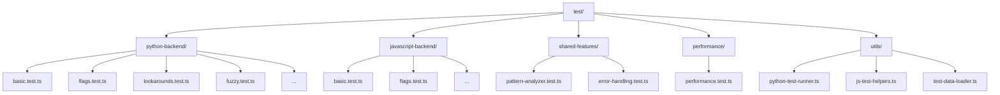

# New Project Plan: Comprehensive Test Suite Restructuring

### 1. Introduction & Objectives

This plan outlines the complete restructuring of the project's test suite, moving away from the existing `test/legacy/` structure to a new, comprehensive approach founded on the extensive `test-regex.py` Python test suite. The primary objective is to achieve robust and equivalent test coverage for both JavaScript and Python backends, ensuring functional parity and identifying any behavioral discrepancies.

**Key Objectives:**
*   **Foundation**: Utilize the hundreds of comprehensive Python regex tests from `test-regex.py` as the primary source for new TypeScript test cases.
*   **Coverage Parity**: Strive for exact parity in test assertions where feasible, otherwise ensure functional equivalence for all regex features and edge cases.
*   **Modern Structure**: Implement a clear, maintainable, and scalable TypeScript-based test architecture.
*   **Backend Validation**: Develop distinct utilities for validating both JavaScript and Python backend behaviors.
*   **Performance & Regression**: Integrate performance and regression testing to maintain quality and prevent regressions.

### 2. Phase 1: Analysis and Extraction of `test-regex.py`

This phase focuses on understanding and preparing the Python test cases for migration.

#### Milestones:
*   **M1.1: Identify Test Categories**: Group Python test methods into logical categories (e.g., `test_basic_regex_sub`, `test_flags`, `test_fuzzy`, `test_recursive`).
*   **M1.2: Map Python Assertions to TypeScript Equivalents**: Create a mapping or guide for converting `unittest.TestCase` assertions (e.g., `self.assertEqual`, `self.assertRaisesRegex`) to Vitest/Jest assertions.
*   **M1.3: Develop Test Case Extraction Strategy**: Define a systematic approach for extracting individual test cases, including patterns, input strings, expected outputs, and flags. Prioritize 1:1 conversion, falling back to functional coverage for complex or Python-specific constructs.

#### Deliverables:
*   Categorized list of test methods from `test-regex.py`.
*   Documentation of Python-to-TypeScript assertion mapping.
*   Initial script or manual process for test case extraction (e.g., a `tools/extract-regex-tests.py` script that outputs JSON or a similar structured format).

#### Diagram: Test Extraction Flow
```mermaid
graph TD
    A[test-regex.py] --> B{Parse Python Test Methods}
    B --> C{Identify Test Categories}
    C --> D[Categorized Test Cases]
    D --> E{Map Assertions to TypeScript}
    E --> F[Extraction Strategy & Tools]
    F --> G[Structured Test Data (e.g., JSON)]
```

### 3. Phase 2: Defining the New TypeScript Test Structure

This phase establishes the new, organized directory and file structure for the TypeScript test suite.

#### Milestones:
*   **M2.1: Propose New Test Directory Structure**: Design a hierarchical structure under `test/` that logically groups tests based on regex features, backend, and type (unit/integration).
*   **M2.2: Define Naming Conventions**: Establish clear naming conventions for test files and test suites within the new structure (e.g., `test/python-backend/basic.test.ts`, `test/javascript-backend/flags.test.ts`).
*   **M2.3: Create Initial Test Files**: Scaffold the new test files and directories based on the proposed structure and identified test categories.

#### Deliverables:
*   Proposed `test/` directory structure.
*   Documented naming conventions.
*   Empty or skeleton TypeScript test files in the new structure.

#### Diagram: New Test Structure


### 4. Phase 3: Implementing Test Utilities and Helpers

This phase focuses on building the necessary infrastructure to execute and validate tests against both backends.

#### Milestones:
*   **M3.1: Develop Python Test Runner Utility**: Create a TypeScript utility (`test/utils/python-test-runner.ts`) that can execute Python regex operations within the Pyodide environment and return results in a consistent format for TypeScript assertions. This utility will handle pattern registration, execution, and result parsing.
*   **M3.2: Implement JavaScript Test Helpers**: Create or adapt existing helpers (`test/utils/js-test-helpers.ts`) for consistent testing of JavaScript backend regex operations.
*   **M3.3: Create Test Data Loader**: Develop a utility (`test/utils/test-data-loader.ts`) to load extracted test cases (e.g., from JSON files generated in Phase 1) into the TypeScript test environment.
*   **M3.4: Integrate with Existing Test Runner**: Ensure the new utilities are compatible with the existing Vitest setup.

#### Deliverables:
*   `test/utils/python-test-runner.ts` with functions for `compile`, `match`, `search`, `findall`, `sub`, `split`, etc., against the Python backend.
*   `test/utils/js-test-helpers.ts` with common assertion helpers for JavaScript regex.
*   `test/utils/test-data-loader.ts` for loading external test data.

### 5. Phase 4: Populating the New Test Suite

This phase involves writing the actual TypeScript test cases using the extracted data and new utilities.

#### Milestones:
*   **M4.1: Convert Basic Regex Tests**: Start with straightforward `test-regex.py` cases (e.g., `test_search_star_plus`, `test_basic_regex_sub`) and convert them to TypeScript tests in their respective backend-specific files.
*   **M4.2: Implement Tests for Flags and Special Characters**: Address tests related to regex flags (`regex.I`, `regex.M`, `regex.X`, `regex.S`, `regex.L`, `regex.U`, `regex.A`) and special character escapes.
*   **M4.3: Handle Grouping and Backreferences**: Convert tests involving capturing groups, named groups, and backreferences.
*   **M4.4: Address Lookarounds and Conditionals**: Implement tests for positive/negative lookahead/lookbehind and conditional patterns.
*   **M4.5: Tackle Fuzzy Matching and Recursive Patterns**: Convert complex fuzzy matching and recursive pattern tests, paying close attention to their unique behaviors.
*   **M4.6: Ensure Exact Parity/Functional Equivalence**: For each converted test, verify that the TypeScript test achieves exact parity with the Python test's outcome, or clearly documents any functional equivalence if direct parity is not possible due to backend differences.

#### Deliverables:
*   Populated TypeScript test files under `test/python-backend/`, `test/javascript-backend/`, and `test/shared-features/`.
*   Documentation of any known behavioral differences between backends identified during testing.

### 6. Phase 5: Performance and Regression Testing Setup

This phase focuses on integrating performance benchmarks and establishing a robust regression testing framework.

#### Milestones:
*   **M5.1: Migrate Performance Tests**: Adapt relevant performance tests from `test-regex.py` (e.g., `test_stack_overflow`, `test_bug_418626`) into the `test/performance/` directory.
*   **M5.2: Establish Performance Baselines**: Run initial performance tests and record baselines for key operations on both backends.
*   **M5.3: Implement Regression Test Automation**: Ensure the entire new test suite can be run automatically as part of CI/CD to catch regressions.
*   **M5.4: Define Performance Monitoring**: Outline how performance changes will be tracked and alerted upon.

#### Deliverables:
*   `test/performance/` directory with migrated performance tests.
*   Initial performance benchmark results.
*   Updated `package.json` scripts for running the new test suite.

### 7. Phase 6: Documentation and Cleanup

The final phase involves updating project documentation and removing deprecated test files.

#### Milestones:
*   **M6.1: Update `PLAN.md`**: Replace the current `PLAN.md` with this new comprehensive plan.
*   **M6.2: Update `TODO.md`**: Replace the current `TODO.md` with specific actionable tasks derived from this plan.
*   **M6.3: Document New Test Architecture**: Add a section to `README.md` or a new `TESTING.md` detailing the new test structure, how to add new tests, and how to run them.
*   **M6.4: Remove Legacy Test Files**: Delete the `test/legacy/` directory and its contents after successful migration and validation.

#### Deliverables:
*   Updated `PLAN.md` and `TODO.md`.
*   New or updated `README.md`/`TESTING.md` documentation.
*   Cleaned `test/` directory.